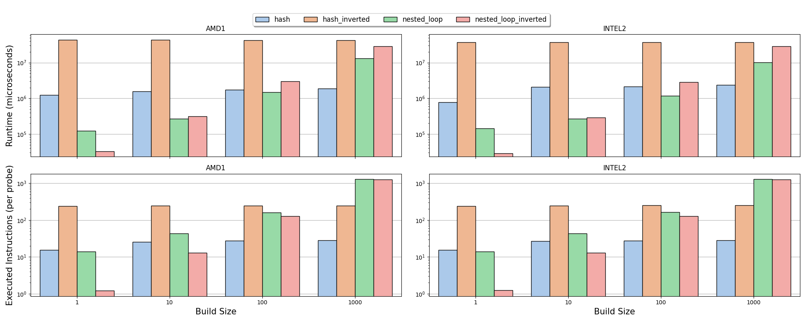

# DE-Lab-Base
This repository contains a small framework to run C++ (benchmarks) on the DE-Lab.

Supported features are:
- scripts for **execution on multiple, dynamically definable nodes on the DE-Lab**
- **Argument parsing** (and expansion of lists of arguments)
- **perf-cpp** wrapper
- **json output** handling

The repository contains a **small join operator comparison** between a **"hash join"** and **"nested loop join"**. This can be used as an orientation for own implementations.

# Getting Started
To build this project locally, simply execute the following commands:

```
mkdir cmake-build-release
cd cmake-build-release
cmake -DCMAKE_BUILD_TYPE=Release ..
make -j
```

Alternatively use `-DCMAKE_BUILD_TYPE=RelWithDebInfo` for debuggable builds.

Executable benchmarks can then be found under the `benchmark` folder in the build directory e.g., `cmake-build-release/benchmark/join_benchmark`.

To execute a specific benchmark on the DE Lab, clone this repository onto the DE Lab and execute from within the base directory:

```shell
/usr/bin/bash ./scripts/delab_run_benchmark.sh <executable_name> <run_name> <...run_arguments>
```

For example:
```shell
/usr/bin/bash ./scripts/delab_run_benchmark.sh join_benchmark join_bench_dif_build_sizes --probe_size=100000000 --build_size=1,10,100,1000
```

The script will automatically generate and schedule `sbatch` files for all nodes defined in `scripts/config.sh`. These can be found under `results/<run_name>` (`results/join_bench_dif_build_sizes`). Every job will then build and execute the benchmark. To check the state of the run you can execute `squeue -u first.last`. The results (including logs and errors) can then again be found in `results/<run_name>`. To pull these to your local machine, we recommend using `scp -r`.

Locally, we can use the helper functions defined in `visualization/helper.py` to import the benchmark results. It will flatten the written result-jsons into a one dimensional table and add the node-config name as an id. This makes usage of `seaborn` much easier (see `/visualization/join_benchmark.py`).



# Slurm
We use Slurm to run and manage jobs on the DE-Lab. While this framework offers basic scripts to run C++ executables on multiple definable nodes, understanding basic Slurm concepts and commands is still required.

To get familiar with these, check out the HPI internal DE Lab documentation or check the [official Slurm documentation](https://slurm.schedmd.com/documentation.html).

Important commands include, but are not limited to:
 - `squeue (-u first.last)`- List currently running/queue jobs.
 - `sinfo` - List information about nodes.
 - `scancel (-u first.last / <job-id>)` - Cancel running/queued jobs.
 - `sbatch/salloc/srun` - Run Jobs.

# Dependency Management

This repository uses images to manage dependencies and execution environments.
The images can be found in `/hpi/fs00/share/fg-rabl/delab-images`. If you want to add dependencies, check the HPI internal DE Lab documentation (search for `Container customisation & persistence`).

# Using perf-cpp

`BenchmarkRunner` offers a wrapper to [`perf-cpp`](https://github.com/jmuehlig/perf-cpp) which allows users to specify hardware events that can then be monitored from within C++ code.

The wrapper needs to be initialized once.

```C++
BenchmarkRunner::get().perf_wrapper.initialize();
```

This will set the event counters specified in `src/benchmark/utils/perf_wrapper.hpp`.
To actual count something, we simply call:

```C++
BenchmarkRunner::get().perf_wrapper.start();
// Do something
BenchmarkRunner::get().perf_wrapper.stop();
```
The event counters can then be stored to a json object using:

```C++
BenchmarkRunner::get().perf_wrapper.result(results, config.probe_size);
```

Note that the `config.probe_size` parameter acts as a normalization unit (e.g., `cycles` are divided by `config.probe_size`). Alternative, we can also print the counters:


```C++
for (const auto [name, value] : BenchmarkRunner::get().perf_wrapper.result())
{
    std::cout << name << ": " << value << std::endl;
}
```

To start another event monitoring, simply call `start()` and `stop()` again. Note that if we want to monitor events from multiple threads, we have to call `start()` in the parent thread, before the creation of the other threads.

# Caveats

Be careful when pulling new commits. While for each benchmark, we store the git SHA of the current commit, at build time, we simply consider whatever code is present in the project directory.

# Adding/Removing/Modifying nodes

`scripts/config.sh` contains the required required definitions for DE-Lab nodes. `node_config` controls which of these nodes are actually used when running the benchmark scripts. As most node definitions contain the maximum number of CPUs, we basically allocate the node exclusively (i.e., only our benchmark job can run on that node). For easier prototyping, it might be easier to reduce the number of used CPUs.
